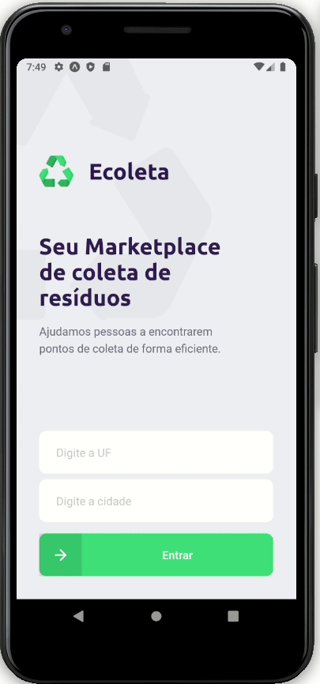

[Official repository](https://github.com/Rocketseat/nlw-01-booster/) is here (in portuguese).

<h1 align="center">
    
</h1>

  <a href="#rocket-tecnologias">Technologies</a>&nbsp;&nbsp;&nbsp;|&nbsp;&nbsp;&nbsp;
  <a href="#-projeto">Project</a>&nbsp;&nbsp;&nbsp;|&nbsp;&nbsp;&nbsp;
  <a href="#-layout">Layout</a>

 

  

## 🚀 Technologies

This project was developed with the following technologies:

- [Node.js](https://nodejs.org/en/)
- [React](https://reactjs.org)
- [React Native](https://facebook.github.io/react-native/)
- [Expo](https://expo.io/)

## 💻 Project

Ecoleta is a marketplace that helps people to find waste collection points efficiently.

### Web demo:

 
    

### Mobile demo:

 
    

## 🔖 Layout

You can see the project layout [here](https://www.figma.com/file/9TlOcj6l7D05fZhU12xWT3/Ecoleta-Booster?node-id=0%3A1). A [Figma](http://figma.com/) account is necessary tho.

